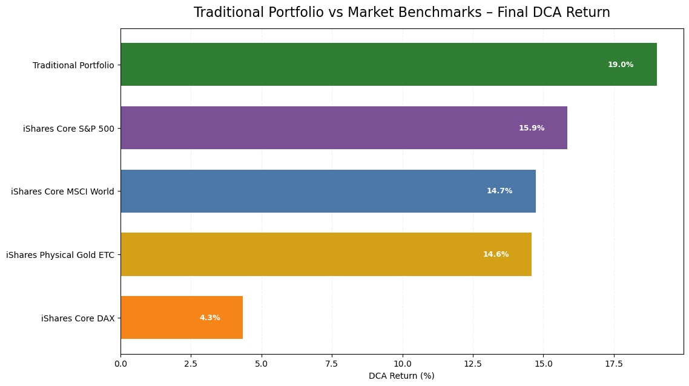
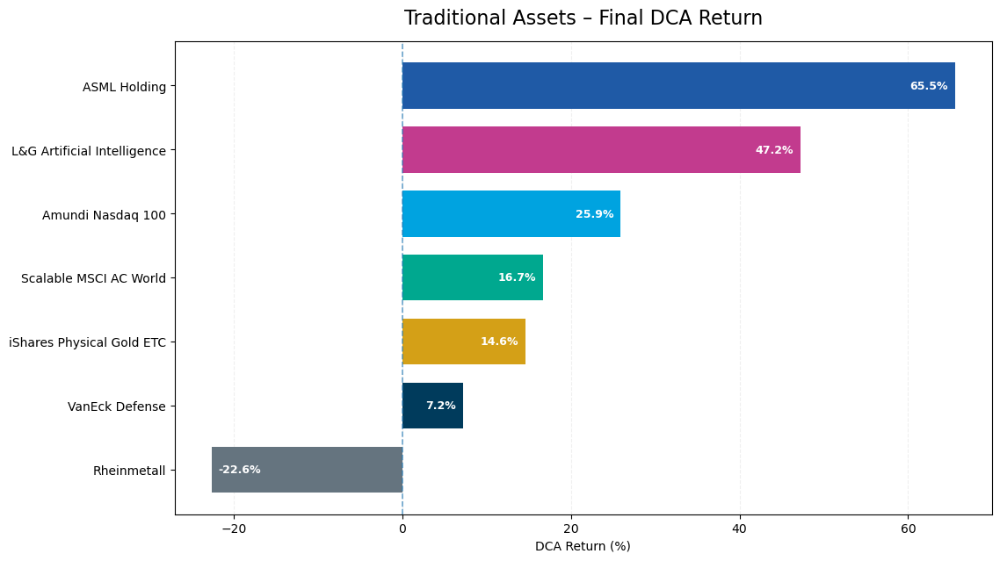

# Multi-Asset DCA Portfolio Analysis

**Portfolio performance, risk, benchmarks, diversification, and dimensional data modeling — May 2025 to May 2026**

This project started in May 2025 as a simple Excel record of a real investment portfolio. At that point, Excel was mainly a way to keep track of purchases rather than an analytical workflow. During a later data-analysis bootcamp, I began rebuilding the idea with Python, pandas, visualization, and data modeling. The result is a reproducible portfolio-analysis workflow that grew from a simple spreadsheet into a structured data project.

My academic background is in history and Iranian studies, not economics, finance, computer science, software engineering, or AI engineering. I am approaching this project as a historian moving into data analysis: defining questions, learning tools, checking assumptions, validating results, and documenting the process.

---

## Project journey

The development of this project is part of the project itself.

- **May 2025:** I began recording investment activity in Excel.
- **First stage:** the spreadsheet was mainly a tracking tool for dates, assets, and amounts.
- **During my data-analysis bootcamp:** I learned how the same information could be cleaned, structured, analyzed, and visualized with Python and other data tools.
- **Next stage:** I rebuilt the analysis in Jupyter with pandas, yfinance, and matplotlib, then added DCA simulations, risk metrics, benchmark comparisons, diversification tests, and contribution analysis.
- **Final stage:** I transformed the analytical output into a validated star schema that can be loaded into SQL or Power BI.

The goal is not to present myself as a quantitative-finance specialist or software engineer. The goal is to show how I can take a real question, learn the necessary tools, build a reproducible workflow, detect inconsistencies, and improve the model through repeated testing.

---

## AI-assisted development

This project was developed with **extensive assistance from AI tools**, and I want that to be explicit.

I used AI to help:

- draft and revise Python code;
- debug errors and identify methodological inconsistencies;
- explain Python, pandas, and data-modeling concepts that were new to me;
- review calculations and compare alternative implementations;
- improve chart presentation;
- review and draft parts of the README files and this report.

I did **not** write every line of code from memory, and I do not present the project as if I did. I also used video tutorials, documentation, and repeated experimentation.

My role was to define the questions, choose the portfolio assumptions, run and inspect the code, challenge results that did not make sense, request corrections, compare outputs, and validate the final workflow. AI was used as a learning and development tool, not as a substitute for checking the results.

---

## What the analysis covers

The analysis separates three related strategies:

| Strategy | Type | Monthly normalized amount | Composition |
|---|---|---:|---|
| Traditional portfolio | Reflects a real-world investment structure | 100 units | 5 ETFs/ETCs and 2 individual stocks |
| Cryptocurrency DCA | Simulated | 100 units | Bitcoin, Ethereum, Solana |
| Combined scenario | Hypothetical | 600 units | 500 traditional + 100 crypto |

For the controlled combined comparison, the 600-unit combined scenario is compared with a **600-unit 100% traditional baseline**. Scaling the traditional portfolio from 100 to 600 units does not change its percentage return; it only ensures that both scenarios use the same total monthly capital.

Amounts are normalized to protect private financial information. The ratios, allocations, and return calculations remain analytically comparable.

**Purchase rule.** The planned purchase date is the 4th of each month. Weekend dates move to the following Monday, and exchange-traded assets move to the next available trading day when necessary. The analysis contains 13 monthly purchases from May 2025 through May 2026.

**Final valuation date.** Final performance is measured on **29 May 2026**, the last common trading day in the analysis. Time-series charts use the monthly purchase/common observation dates and add 29 May 2026 as the final valuation point without adding a new contribution.

---

## Data

- **Market data:** Yahoo Finance daily closing prices, quoted in EUR.
- **Traditional allocation:** Scalable MSCI AC World Xtrackers (30%), VanEck Defense (25%), Amundi Nasdaq 100 (15%), L&G Artificial Intelligence (10%), iShares Physical Gold ETC (10%), ASML Holding (5%), Rheinmetall (5%).
- **Simulated crypto allocation:** Bitcoin (10%), Ethereum (60%), Solana (30%).
- **Benchmarks:** iShares Core MSCI World, iShares Core DAX, iShares Core S&P 500, and iShares Physical Gold ETC.
- **Events:** 19 market, regulatory, macroeconomic, and geopolitical events used only as contextual chart markers.

Returns use **unadjusted closing prices**, so dividends are excluded. This may slightly understate the total return of dividend-paying individual stocks.

---

## Methodology

1. **DCA simulation** — monthly purchased units are calculated as `allocation / closing price`, and holdings accumulate over time.
2. **Cumulative DCA return** — `(portfolio value - total contributed) / total contributed`. This is a simple return on contributed capital under the DCA schedule; it is **not** IRR/XIRR.
3. **Cash-flow-adjusted monthly return** — `(value_t - contribution) / value_{t-1} - 1`. This removes the new monthly contribution before calculating the period return used for the risk analysis.
4. **Risk metrics** — annualized return, annualized volatility, Sharpe ratio with a simplified 0% risk-free rate, and maximum drawdown.
5. **Correlation** — weekly returns are used to compare how the traditional holdings moved together.
6. **Benchmarking** — each benchmark follows the same 13-purchase DCA schedule and normalized monthly amount.
7. **Contribution analysis** — each holding's profit/loss is divided by total portfolio investment and expressed in percentage points.
8. **Scenario analysis** — the project compares a 600-unit traditional baseline with a 500 traditional + 100 crypto scenario, and also compares the traditional portfolio with and without its 10% gold allocation.

---

## Key results



*Final DCA return at 29 May 2026 under an identical monthly DCA schedule.*

- Traditional portfolio: **+19.02%**
- iShares Core S&P 500: **+15.86%**
- iShares Core MSCI World: **+14.73%**
- iShares Physical Gold ETC: **+14.59%**
- iShares Core DAX: **+4.35%**

The traditional portfolio therefore finished 3.16 percentage points ahead of the closest benchmark in this specific one-year sample.

### Risk comparison

| Strategy | Annualized return | Volatility | Sharpe | Max drawdown |
|---|---:|---:|---:|---:|
| Traditional | +31.33% | 13.96% | 2.04 | -4.67% |
| Simulated crypto | -2.10% | 69.32% | 0.30 | -55.34% |
| Combined | +28.47% | 19.55% | 1.38 | -9.19% |

The risk table uses cash-flow-adjusted monthly returns. These figures should not be confused with the cumulative DCA returns.

Two columns in the table cannot be divided into one another, so the calculation is stated explicitly. The annualized return is compounded geometrically, `(1 + r).prod() ** (12 / n) - 1`, while the Sharpe ratio annualizes the arithmetic mean of the same monthly returns, `r.mean() * 12 / annualized volatility`, with a 0% risk-free rate. Both conventions are standard, but they measure different quantities. This is also why the simulated crypto strategy shows a positive Sharpe ratio next to a negative annualized return: at 69.32% volatility the arithmetic mean of the monthly returns is positive while the compounded result is negative.

The simulated crypto strategy ended at approximately **-28.30%** on the final valuation date. The controlled 600-unit combined scenario ended at approximately **+11.13%**, compared with **+19.02%** for the 600-unit traditional baseline.

### Individual traditional holdings



| Asset | DCA return | Contribution to portfolio return |
|---|---:|---:|
| ASML Holding | +65.53% | +3.28 pp |
| L&G Artificial Intelligence | +47.23% | +4.72 pp |
| Amundi Nasdaq 100 | +25.89% | +3.88 pp |
| Scalable MSCI AC World | +16.67% | +5.00 pp |
| iShares Physical Gold ETC | +14.59% | +1.46 pp |
| VanEck Defense | +7.21% | +1.80 pp |
| Rheinmetall | -22.56% | -1.13 pp |

This shows why return ranking and contribution ranking are different. ASML had the highest percentage return, while the larger MSCI AC World position contributed more to the total portfolio result.

### Diversification

The weekly correlation matrix shows that the portfolio contains clusters:

- Amundi Nasdaq 100 and L&G Artificial Intelligence: **0.88**
- Scalable MSCI AC World with Amundi Nasdaq 100: **0.89**
- Scalable MSCI AC World with L&G Artificial Intelligence: **0.80**
- VanEck Defense and Rheinmetall: **0.77**

Gold was the clearest diversifier in this particular sample. Its weekly correlation with the equity holdings ranged approximately from **-0.08 to +0.20**.

Gold and Bitcoin showed a correlation of **-0.21** on the common monthly observation dates. Because the sample is short, this should be treated as a period-specific observation rather than a stable long-term relationship.

Removing the 10% gold allocation and redistributing it proportionally across the remaining traditional holdings would have produced a final DCA return of approximately **+19.51%**, compared with **+19.02%** with gold. In this period, gold slightly reduced the endpoint return while changing the path of the portfolio.

---

## Dimensional data model

The final notebook section converts the analysis into a star schema rather than exporting unrelated result tables.

| Table | Type | Grain |
|---|---|---|
| `dim_date` | Dimension | One calendar date |
| `dim_asset` | Dimension | One asset |
| `dim_strategy` | Dimension | One strategy |
| `bridge_strategy_asset` | Bridge | One strategy-asset pair |
| `fact_market_price` | Fact | Date x asset |
| `fact_dca_purchase` | Fact | Date x strategy x asset |
| `fact_portfolio_performance` | Fact | Date x strategy |
| `fact_event` | Fact | One event |

The notebook runs **24 automated validation checks** covering key uniqueness, composite grains, foreign-key integrity, strategy-asset consistency, allocation totals, and the combined-scenario construction.

---

## Python first, Power BI second

Python/Jupyter is the primary analytical environment for this project.

I prefer working with Python and open-source tools because the transformations, calculations, and assumptions remain visible in code and can be reproduced step by step. Power BI is useful as a presentation layer, but I did not want to rebuild the entire analysis a second time only to reproduce charts that already exist in Python.

I therefore built a compact two-page Power BI report directly on the eight exported CSV tables. Nothing is recalculated by hand: every figure shown in the report comes from the same validated star schema that the notebook produces, aggregated with DAX measures. The dashboard demonstrates that the model can be consumed by a BI tool; it remains intentionally secondary to the Python workflow.

### Report page 1 — Portfolio Overview


KPI cards for total invested, final DCA return, final portfolio value, and profit/loss, plus the traditional allocation, the final DCA return by strategy, and two time-series views (strategies and benchmarks). The numbers match the Python output: 1,300 invested, a final value of 1,547.22, and a final DCA return of +19.02%.

### Report page 2 — Asset & Market Explorer


A per-asset view combining the traditional asset summary (ticker, monthly allocation, final DCA return, contribution in percentage points), weekly normalized price performance, and the final DCA return by asset. A date slicer on `dim_date` filters the period, and a short takeaway panel highlights the contrast between return ranking and contribution ranking.

### Data model in Power BI


The exported model loads without reshaping: three dimensions, one bridge table, four fact tables, and one-to-many single-direction relationships from the dimensions to the facts. A separate `_Measures` table holds the DAX measures used across both report pages, including total invested, final DCA return, final portfolio value, profit/loss, contribution to portfolio return, and the normalized price index.

### Loading the model yourself

If the exported model is loaded into Power BI:

1. import the eight CSV files as UTF-8;
2. mark `dim_date[Date]` as the date table;
3. create one-to-many, single-direction relationships from the dimensions to the fact tables;
4. use `bridge_strategy_asset` when allocation shares are needed;
5. filter portfolio-performance measures by `StrategyKey`, because several strategies intentionally reuse the same assets.

---

## Repository structure

```text
├── multi_asset_dca_portfolio_analysis.ipynb
├── data/
│   ├── dim_date.csv
│   ├── dim_asset.csv
│   ├── dim_strategy.csv
│   ├── bridge_strategy_asset.csv
│   ├── fact_market_price.csv
│   ├── fact_dca_purchase.csv
│   ├── fact_portfolio_performance.csv
│   └── fact_event.csv
├── images/
├── README.md
├── README_DE.md
└── REPORT.md
```

---

## Technologies

Python · pandas · yfinance · matplotlib · Jupyter · CSV · dimensional/star-schema modeling · SQL-ready output · Power BI presentation layer (DAX measures)

---

## Reproducing the notebook

```bash
pip install pandas yfinance matplotlib jupyter
jupyter lab multi_asset_dca_portfolio_analysis.ipynb
```

Run the notebook cells in order. Yahoo Finance may occasionally revise historical market data, so small differences in the last decimal places are possible when the notebook is executed again.

---

## Limitations

- The analysis covers only one year.
- The crypto strategy is simulated; the real-world crypto activity did not follow a fixed monthly schedule.
- The combined portfolio is hypothetical.
- Risk metrics and correlations are based on a short sample.
- Transaction costs, taxes, spreads, and dividends are excluded.
- Event markers are contextual and are not used to claim causality.
- Results from one market period should not be treated as evidence of a repeatable investment advantage.

Past performance does not indicate future results. This project is not investment advice.
