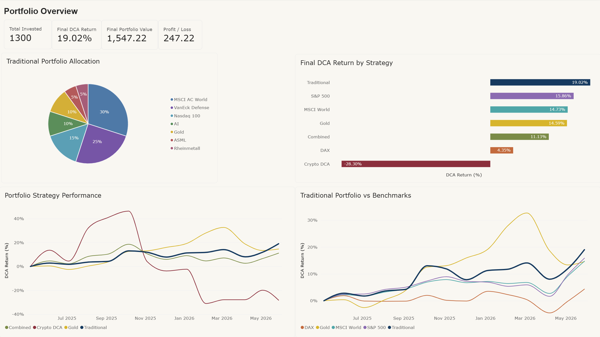
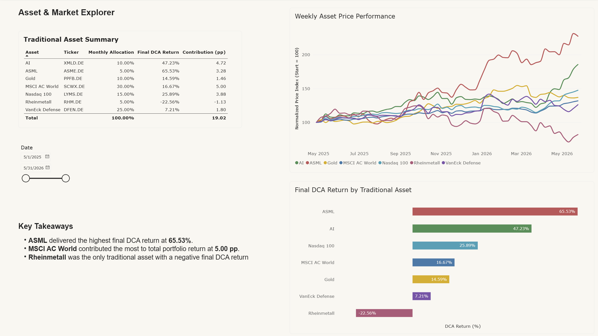
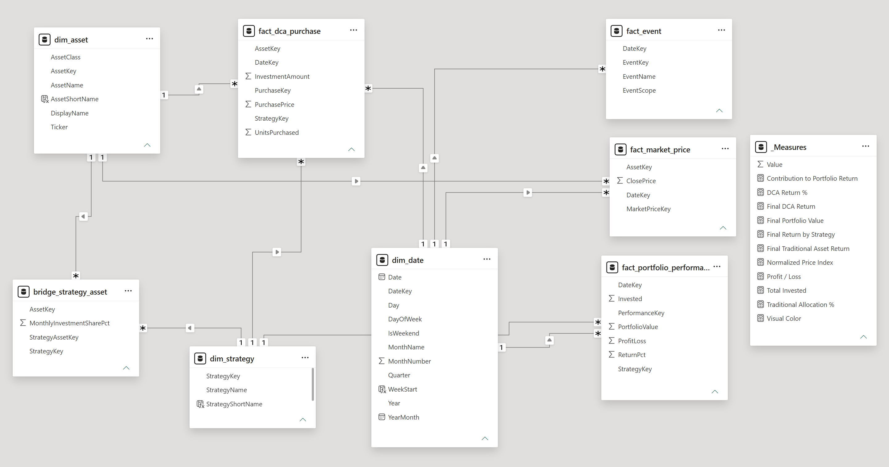

# Multi-Asset-DCA-Portfolioanalyse

[English version](README.md) · [Vollständiger analytischer Bericht](REPORT.md)

**Wertentwicklung, Risiko, Benchmarks, Diversifikation und dimensionale Datenmodellierung — Mai 2025 bis Mai 2026**

Dieses Projekt begann im Mai 2025 als einfache Excel-Liste eines realen Anlageportfolios. Zu diesem Zeitpunkt war Excel für mich vor allem ein Werkzeug, um Käufe festzuhalten, noch kein analytischer Workflow. Während eines späteren Data-Analysis-Bootcamps begann ich, dieselbe Idee mit Python, pandas, Visualisierung und Datenmodellierung neu aufzubauen. Daraus entstand ein reproduzierbarer Analyse-Workflow, der sich von einer persönlichen Tabelle zu einem strukturierten Datenprojekt entwickelt hat.

Mein akademischer Hintergrund liegt in Geschichte und Iranistik, nicht in Wirtschaft, Finanzen, Informatik, Software Engineering oder KI-Engineering. Ich gehe an dieses Projekt als Historiker heran, der in die Datenanalyse einsteigt: Fragen definieren, Werkzeuge lernen, Annahmen prüfen, Ergebnisse validieren und den Prozess nachvollziehbar dokumentieren.

---

## Der Weg des Projekts

Die Entwicklung des Projekts ist selbst ein wichtiger Teil des Projekts.

- **Mai 2025:** Beginn einer einfachen Excel-Liste zur Erfassung realer Anlageaktivität.
- **Erste Phase:** Excel diente hauptsächlich dazu, Daten, Werte und Käufe festzuhalten.
- **Während des Data-Analysis-Bootcamps:** Ich lernte, wie dieselben Informationen mit Python und anderen Datenwerkzeugen bereinigt, strukturiert, analysiert und visualisiert werden können.
- **Nächste Phase:** Ich baute die Analyse in Jupyter mit pandas, yfinance und matplotlib neu auf und ergänzte DCA-Simulationen, Risikokennzahlen, Benchmarkvergleiche, Diversifikationstests und Beitragsanalysen.
- **Letzte Phase:** Die Analyseergebnisse wurden in ein validiertes Sternschema überführt, das in SQL oder Power BI weiterverwendet werden kann.

Das Ziel ist nicht, mich als Quant-Finance-Spezialist oder Softwareentwickler darzustellen. Das Projekt soll zeigen, wie ich eine reale Fragestellung aufgreife, die notwendigen Werkzeuge lerne, Inkonsistenzen erkenne, Ergebnisse überprüfe und ein Modell durch wiederholtes Testen verbessere.

---

## Transparenz zur KI-Unterstützung

Dieses Projekt wurde mit **umfangreicher Unterstützung durch KI-Werkzeuge** entwickelt. Das soll ausdrücklich sichtbar sein.

Ich habe KI unter anderem genutzt, um:

- Python-Code zu entwerfen und zu überarbeiten;
- Fehler zu suchen und methodische Inkonsistenzen zu erkennen;
- mir neue Python-, pandas- und Datenmodellierungs-Schritte erklären zu lassen;
- Berechnungen und alternative Umsetzungen zu prüfen;
- Diagramme visuell zu verbessern;
- Teile der README-Dateien und des Reports zu formulieren und zu überarbeiten.

Ich habe **nicht jede Codezeile aus dem Gedächtnis selbst geschrieben**, und ich möchte das auch nicht so darstellen. Zusätzlich habe ich Videotutorials, Dokumentation und eigenes Ausprobieren verwendet.

Meine Aufgabe bestand darin, die Fragestellungen zu definieren, Portfolioannahmen festzulegen, Code auszuführen und kritisch zu prüfen, unplausible Ergebnisse zu hinterfragen, Korrekturen anzustoßen, verschiedene Ergebnisse zu vergleichen und den finalen Workflow zu validieren. KI war dabei ein Lern- und Entwicklungswerkzeug und kein Ersatz für die Überprüfung der Ergebnisse.

---

## Was analysiert wird

Die Analyse trennt drei miteinander verbundene Strategien:

| Strategie | Art | Monatlicher normierter Betrag | Zusammensetzung |
|---|---|---:|---|
| Traditionelles Portfolio | Entspricht einer realen Anlagestruktur | 100 Einheiten | 5 ETFs/ETCs und 2 Einzelaktien |
| Krypto-DCA | Simuliert | 100 Einheiten | Bitcoin, Ethereum, Solana |
| Kombiniertes Szenario | Hypothetisch | 600 Einheiten | 500 traditionell + 100 Krypto |

Für den kontrollierten Combined-Vergleich wird das 600-Einheiten-Szenario mit einer **600-Einheiten-Baseline aus 100 % traditionellen Anlagen** verglichen. Die Skalierung des traditionellen Portfolios von 100 auf 600 Einheiten verändert die prozentuale Rendite nicht; sie stellt lediglich sicher, dass beide Szenarien mit demselben monatlichen Gesamtkapital verglichen werden.

Die Beträge sind normiert, damit private Finanzinformationen nicht offengelegt werden. Verhältnisse, Allokationen und Renditeberechnungen bleiben analytisch vergleichbar.

**Kaufregel.** Der geplante Kauf erfolgt am 4. eines Monats. Fällt der Termin auf ein Wochenende, wird er auf den folgenden Montag verschoben; bei börsengehandelten Werten gegebenenfalls weiter auf den nächsten verfügbaren Handelstag. Insgesamt umfasst die Analyse 13 monatliche Käufe von Mai 2025 bis Mai 2026.

**Finaler Bewertungsstichtag.** Die abschließende Performance wird zum **29. Mai 2026** bewertet. Zeitreihendiagramme verwenden die monatlichen Kauf- bzw. gemeinsamen Beobachtungstage und ergänzen den 29. Mai 2026 als letzten Bewertungszeitpunkt, ohne eine weitere Einzahlung hinzuzufügen.

---

## Daten

- **Marktdaten:** tägliche Schlusskurse von Yahoo Finance, in EUR.
- **Traditionelle Allokation:** Scalable MSCI AC World Xtrackers (30 %), VanEck Defense (25 %), Amundi Nasdaq 100 (15 %), L&G Artificial Intelligence (10 %), iShares Physical Gold ETC (10 %), ASML Holding (5 %), Rheinmetall (5 %).
- **Simulierte Krypto-Allokation:** Bitcoin (10 %), Ethereum (60 %), Solana (30 %).
- **Benchmarks:** iShares Core MSCI World, iShares Core DAX, iShares Core S&P 500 und iShares Physical Gold ETC.
- **Ereignisse:** 19 marktbezogene, regulatorische, makroökonomische und geopolitische Ereignisse, die ausschließlich als Kontextmarkierungen verwendet werden.

Verwendet werden **unbereinigte Schlusskurse**. Dividenden sind daher nicht in den Renditen enthalten. Bei dividendenzahlenden Einzelaktien kann die tatsächliche Gesamtrendite dadurch leicht unterschätzt werden.

---

## Methodik

1. **DCA-Simulation** — die monatlich gekauften Anteile werden als `Allokation / Schlusskurs` berechnet und anschließend kumuliert.
2. **Kumulative DCA-Rendite** — `(Portfoliowert - gesamte Einzahlungen) / gesamte Einzahlungen`. Das ist eine einfache Rendite auf das eingezahlte Kapital innerhalb des DCA-Modells; sie ist **keine** IRR-/XIRR-Berechnung.
3. **Cashflow-bereinigte Monatsrendite** — `(Wert_t - Einzahlung) / Wert_{t-1} - 1`. Die neue monatliche Einzahlung wird vor der Periodenrendite herausgerechnet und diese Reihe für die Risikoanalyse verwendet.
4. **Risikokennzahlen** — annualisierte Rendite, annualisierte Volatilität, Sharpe Ratio mit vereinfachtem risikofreiem Zins von 0 % und maximaler Drawdown.
5. **Korrelation** — Wochenrenditen zeigen, wie stark sich die traditionellen Positionen gemeinsam bewegt haben.
6. **Benchmarking** — jeder Benchmark folgt demselben 13-Käufe-DCA-Zeitplan und demselben normierten monatlichen Betrag.
7. **Beitragsanalyse** — Gewinn bzw. Verlust jeder Position wird auf die gesamte Investitionssumme bezogen und in Prozentpunkten ausgewiesen.
8. **Szenarioanalyse** — verglichen werden eine 600-Einheiten-Traditional-Baseline mit 500 Traditional + 100 Krypto sowie das traditionelle Portfolio mit und ohne seine 10-%-Goldallokation.

---

## Zentrale Ergebnisse


*Finale DCA-Rendite zum 29. Mai 2026 bei identischem monatlichem DCA-Zeitplan.*

- Traditionelles Portfolio: **+19,02 %**
- iShares Core S&P 500: **+15,86 %**
- iShares Core MSCI World: **+14,73 %**
- iShares Physical Gold ETC: **+14,59 %**
- iShares Core DAX: **+4,35 %**

Das traditionelle Portfolio lag in dieser konkreten einjährigen Stichprobe damit 3,16 Prozentpunkte vor dem nächstbesten Benchmark.

### Risikovergleich

| Strategie | Annualisierte Rendite | Volatilität | Sharpe | Max. Drawdown |
|---|---:|---:|---:|---:|
| Traditionell | +31,33 % | 13,96 % | 2,04 | -4,67 % |
| Simulierte Krypto-Strategie | -2,10 % | 69,32 % | 0,30 | -55,34 % |
| Kombiniert | +28,47 % | 19,55 % | 1,38 | -9,19 % |

Die Risikotabelle basiert auf cashflow-bereinigten Monatsrenditen. Diese Kennzahlen dürfen nicht mit den kumulierten DCA-Renditen verwechselt werden.

Zwei Spalten der Tabelle lassen sich nicht ineinander umrechnen, deshalb hier die verwendete Berechnung: Die annualisierte Rendite wird geometrisch aufgezinst, `(1 + r).prod() ** (12 / n) - 1`, während die Sharpe Ratio das arithmetische Mittel derselben Monatsrenditen annualisiert, `r.mean() * 12 / annualisierte Volatilität`, bei einem risikofreien Zins von 0 %. Beide Konventionen sind üblich, sie messen aber nicht dasselbe. Daraus erklärt sich auch, warum die simulierte Krypto-Strategie eine positive Sharpe Ratio neben einer negativen annualisierten Rendite ausweist: Bei 69,32 % Volatilität ist das arithmetische Mittel der Monatsrenditen positiv, während das aufgezinste Ergebnis negativ ist.

Die simulierte Krypto-Strategie endete am finalen Bewertungsstichtag bei ungefähr **-28,30 %**. Das kontrollierte Combined-Szenario mit 600 Einheiten endete bei ungefähr **+11,13 %**, verglichen mit **+19,02 %** für die 600-Einheiten-Traditional-Baseline.

### Einzelne traditionelle Positionen


| Asset | DCA-Rendite | Beitrag zur Portfoliorendite |
|---|---:|---:|
| ASML Holding | +65,53 % | +3,28 PP |
| L&G Artificial Intelligence | +47,23 % | +4,72 PP |
| Amundi Nasdaq 100 | +25,89 % | +3,88 PP |
| Scalable MSCI AC World | +16,67 % | +5,00 PP |
| iShares Physical Gold ETC | +14,59 % | +1,46 PP |
| VanEck Defense | +7,21 % | +1,80 PP |
| Rheinmetall | -22,56 % | -1,13 PP |

Damit wird deutlich, warum eine Rangfolge nach Rendite nicht identisch mit einer Rangfolge nach Renditebeitrag ist. ASML hatte die höchste prozentuale Rendite, während die größere MSCI-AC-World-Position stärker zum Gesamtergebnis beitrug.

### Diversifikation

Die wöchentliche Korrelationsmatrix zeigt mehrere Cluster:

- Amundi Nasdaq 100 und L&G Artificial Intelligence: **0,88**
- Scalable MSCI AC World mit Amundi Nasdaq 100: **0,89**
- Scalable MSCI AC World mit L&G Artificial Intelligence: **0,80**
- VanEck Defense und Rheinmetall: **0,77**

Gold war in dieser Stichprobe der deutlichste Diversifikator. Die wöchentliche Korrelation von Gold mit den Aktienpositionen lag ungefähr zwischen **-0,08 und +0,20**.

Gold und Bitcoin zeigten an den gemeinsamen monatlichen Beobachtungstagen eine Korrelation von **-0,21**. Wegen der kurzen Stichprobe sollte dies als Beobachtung für diesen Zeitraum und nicht als stabile langfristige Beziehung verstanden werden.

Wird die 10-%-Goldallokation entfernt und proportional auf die übrigen traditionellen Positionen verteilt, ergibt sich eine finale DCA-Rendite von ungefähr **+19,51 %** gegenüber **+19,02 %** mit Gold. Gold verringerte in diesem Zeitraum also den Endwert leicht, veränderte aber zugleich den Verlauf des Portfolios.

---

## Dimensionales Datenmodell

Der letzte Notebook-Teil überführt die Analyse in ein Sternschema, statt nur einzelne Ergebnistabellen zu exportieren.

| Tabelle | Typ | Granularität |
|---|---|---|
| `dim_date` | Dimension | Ein Kalendertag |
| `dim_asset` | Dimension | Ein Asset |
| `dim_strategy` | Dimension | Eine Strategie |
| `bridge_strategy_asset` | Bridge | Ein Strategie-Asset-Paar |
| `fact_market_price` | Fakt | Datum x Asset |
| `fact_dca_purchase` | Fakt | Datum x Strategie x Asset |
| `fact_portfolio_performance` | Fakt | Datum x Strategie |
| `fact_event` | Fakt | Ein Ereignis |

Das Notebook führt **24 automatische Validierungen** durch. Geprüft werden unter anderem eindeutige Schlüssel, zusammengesetzte Granularitäten, Fremdschlüsselbeziehungen, Strategie-Asset-Konsistenz, Allokationssummen sowie der Aufbau des Combined-Szenarios.

---

## Python zuerst, Power BI als Ergänzung

Python/Jupyter ist die primäre Analyseumgebung dieses Projekts.

Ich arbeite lieber mit Python und Open-Source-Werkzeugen, weil Transformationen, Berechnungen und Annahmen im Code sichtbar bleiben und Schritt für Schritt reproduziert werden können. Power BI ist als Präsentationsschicht nützlich, aber ich wollte nicht die gesamte Analyse ein zweites Mal nachbauen, nur um bereits vorhandene Python-Diagramme zu reproduzieren.

Ergänzend habe ich deshalb einen kompakten zweiseitigen Power-BI-Bericht direkt auf den acht exportierten CSV-Tabellen aufgebaut. Nichts wird dabei manuell neu gerechnet: Alle dargestellten Werte stammen aus demselben validierten Sternschema, das das Notebook erzeugt, und werden über DAX-Measures aggregiert. Das Dashboard zeigt, dass das Modell in einem BI-Werkzeug nutzbar ist; es bleibt bewusst eine Ergänzung und nicht der Kern des Projekts.

### Berichtsseite 1 — Portfolio Overview



KPI-Karten für eingezahltes Kapital, finale DCA-Rendite, finalen Portfoliowert und Gewinn/Verlust, dazu die traditionelle Allokation, die finale DCA-Rendite je Strategie und zwei Zeitreihen (Strategien und Benchmarks). Die Werte entsprechen den Python-Ergebnissen: 1.300 eingezahlt, Endwert 1.547,22 und eine finale DCA-Rendite von +19,02 %.

### Berichtsseite 2 — Asset & Market Explorer



Eine Einzelwertansicht mit der Übersicht der traditionellen Positionen (Ticker, monatliche Allokation, finale DCA-Rendite, Beitrag in Prozentpunkten), der wöchentlichen normierten Kursentwicklung und der finalen DCA-Rendite je Asset. Ein Datums-Slicer auf `dim_date` filtert den Zeitraum, ein kurzer Textblock hebt den Unterschied zwischen Rendite-Rangfolge und Beitrags-Rangfolge hervor.

### Datenmodell in Power BI



Das exportierte Modell lädt ohne weitere Umbauten: drei Dimensionen, eine Bridge-Tabelle, vier Faktentabellen und 1:n-Beziehungen in einer Richtung von den Dimensionen zu den Fakten. Eine separate `_Measures`-Tabelle enthält die DAX-Measures beider Berichtsseiten, unter anderem eingezahltes Kapital, finale DCA-Rendite, finalen Portfoliowert, Gewinn/Verlust, Beitrag zur Portfoliorendite und den normierten Preisindex.

### Modell selbst laden

Wenn das exportierte Modell in Power BI geladen wird:

1. die acht CSV-Dateien als UTF-8 importieren;
2. `dim_date[Date]` als Datumstabelle markieren;
3. 1:n-Beziehungen in einer Richtung von den Dimensionen zu den Faktentabellen anlegen;
4. `bridge_strategy_asset` verwenden, wenn Allokationsanteile ausgewertet werden;
5. Performance-Kennzahlen nach `StrategyKey` filtern, da mehrere Strategien absichtlich dieselben Assets verwenden.

---

## Aufbau des Repositorys

```text
├── multi_asset_dca_portfolio_analysis.ipynb
├── data/
│   ├── dim_date.csv
│   ├── dim_asset.csv
│   ├── dim_strategy.csv
│   ├── bridge_strategy_asset.csv
│   ├── fact_market_price.csv
│   ├── fact_dca_purchase.csv
│   ├── fact_portfolio_performance.csv
│   └── fact_event.csv
├── images/
├── README.md
├── README_DE.md
└── REPORT.md
```

---

## Technologien

Python · pandas · yfinance · matplotlib · Jupyter · CSV · dimensionales/Sternschema-Datenmodell · SQL-fähiger Export · Power-BI-Präsentationsschicht (DAX-Measures)

---

## Notebook reproduzieren

```bash
pip install pandas yfinance matplotlib jupyter
jupyter lab multi_asset_dca_portfolio_analysis.ipynb
```

Alle Zellen der Reihe nach ausführen. Yahoo Finance kann historische Marktdaten nachträglich geringfügig anpassen; bei einem späteren erneuten Lauf können deshalb kleine Abweichungen in den letzten Nachkommastellen entstehen.

---

## Einschränkungen

- Der Betrachtungszeitraum umfasst nur ein Jahr.
- Die Krypto-Strategie ist simuliert; die reale Krypto-Aktivität folgte keinem festen monatlichen Zeitplan.
- Das Combined-Portfolio ist hypothetisch.
- Risikokennzahlen und Korrelationen basieren auf einer kurzen Stichprobe.
- Transaktionskosten, Steuern, Spreads und Dividenden sind ausgeschlossen.
- Ereignismarkierungen dienen nur als Kontext und begründen keine Kausalität.
- Ergebnisse aus einer einzelnen Marktphase sollten nicht als Beleg für einen dauerhaft wiederholbaren Anlagevorteil verstanden werden.

Vergangene Wertentwicklung lässt keine Rückschlüsse auf künftige Ergebnisse zu. Dieses Projekt ist keine Anlageberatung.
