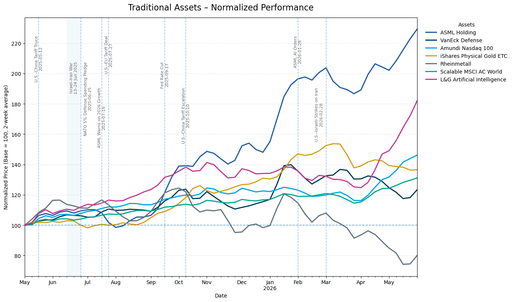
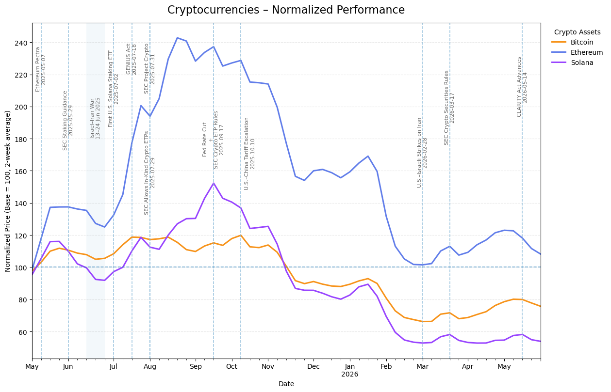
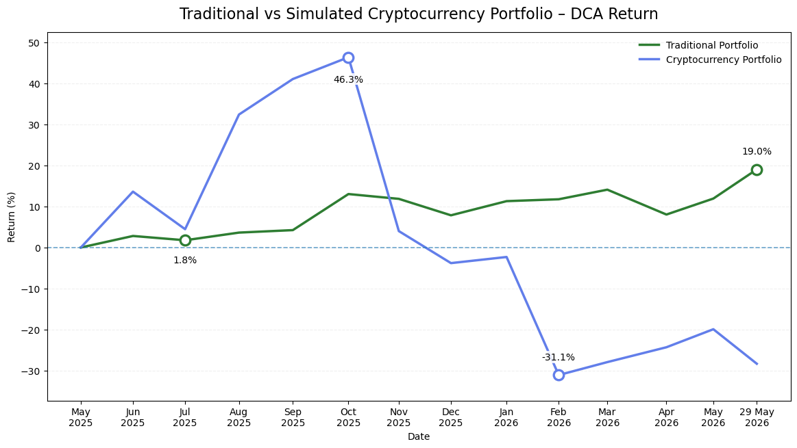
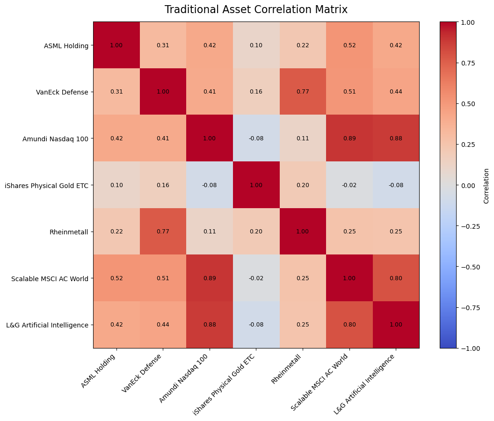
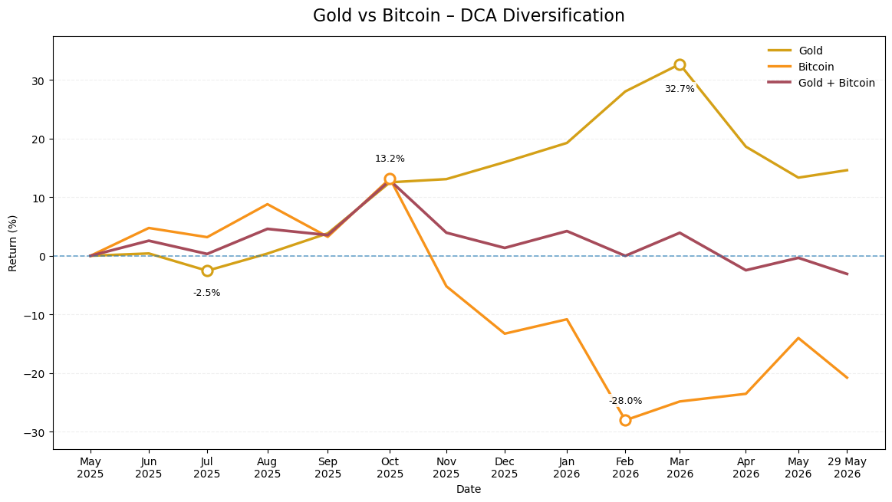
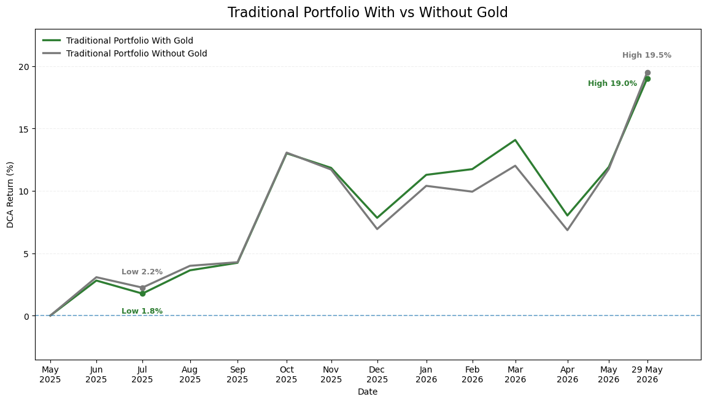

# Analytical Report

## From an Excel Log to a Reproducible Multi-Asset Analysis

**May 2025 – May 2026**

[English README](README.md) | [Deutsche README](README_DE.md)
---

## 1. Where this project started

In May 2025, I began keeping a simple Excel record of my investments. The first version was not a financial model. It was a practical list: dates, assets, amounts, and a way to see what I had bought.

I did not come to this from economics, finance, computer science, software engineering, or AI engineering. My academic background is in history and Iranian studies. At the beginning, Excel was mainly a record-keeping tool for me, and I had no reason to think of the spreadsheet as the starting point of a larger data project.

That changed during a later data-analysis bootcamp. As I learned Python, pandas, visualization, Power BI, and data modeling, I returned to the old spreadsheet with different questions. Instead of only asking whether an investment was up or down, I could ask:

- What happened under a consistent monthly investment schedule?
- Which holdings actually contributed most to the result?
- How much risk accompanied the return?
- Did the portfolio beat broad benchmarks under the same schedule?
- Did apparently different holdings really diversify each other?
- What would happen if part of the traditional allocation were replaced by crypto?
- Could the final analysis be structured as a reusable data model instead of remaining a notebook?

This report documents that development. The project moved from basic Excel tracking to a reproducible Python workflow, then to a dimensional model that can be queried in SQL and optionally presented in Power BI.

For me, that development is as important as the final return figures. It shows a transition from keeping data to asking analytical questions about it.

---

## 2. How the project was built

This project was developed with **extensive AI assistance**.

I used AI throughout the process to draft and revise code, debug errors, explain unfamiliar Python and pandas patterns, review methodology, compare alternative implementations, improve visualizations, and help draft documentation. I did not write every line of code from memory, and I do not want the repository to imply that I did.

I also used video tutorials, documentation, and repeated experimentation. The workflow was iterative: I ran code, inspected outputs, noticed inconsistencies, asked why numbers did not match, changed assumptions when necessary, and reran the analysis.

The project therefore does not demonstrate that I am an AI engineer or a senior Python developer. It demonstrates something different: that I can use modern tools critically, learn from them, test what they produce, and turn an initially simple idea into a structured analytical workflow.

Python became the main environment because I prefer transparent and reproducible workflows where the transformations and calculations are visible. Power BI remains useful to me as a presentation tool, and I built a small dashboard on top of the exported model, but I do not see value in rebuilding every Python chart a second time simply to reproduce the same analysis.

---

## 3. Analytical design

The traditional portfolio reflects the real investment structure, while the monetary values are normalized for privacy. The cryptocurrency component is a simulation because the actual crypto purchases were irregular rather than a fixed monthly plan. The combined portfolio is therefore hypothetical.

### Purchase schedule

The planned purchase date is the 4th of each month. Weekend dates move to the following Monday, and exchange-traded assets move to the next available trading day when necessary. The analysis contains 13 monthly purchases from May 2025 to May 2026.

April 2026 is a useful example: the 4th fell on a Saturday and the traditional assets were not available at the same time as the continuously traded crypto assets. Direct portfolio comparisons therefore use common observation dates after both components are available.

### Normalization and the combined scenario

The base traditional and crypto strategies are each modeled at 100 normalized units per month.

For the controlled combined experiment, the scale changes:

- **Traditional baseline:** 600 units per month, all in the traditional allocation.
- **Combined scenario:** 600 units per month, split into 500 traditional and 100 crypto.

Because percentage returns are unchanged by simply scaling the traditional strategy, this creates a like-for-like comparison in which the total monthly amount is identical and only the allocation changes.

### Final valuation

All final figures are measured on **29 May 2026**, the common final trading date used by the project. The monthly DCA series also show purchase/common observation dates, but the final valuation point is added without a new contribution.

This distinction matters because the market moved materially between the final monthly purchase and the end-of-period valuation.

---

## 4. Return measures

The project uses two different return concepts for different purposes.

| Measure | Formula | Purpose |
|---|---|---|
| Cumulative DCA return | `(portfolio value - total contributed) / total contributed` | Shows the simple gain or loss relative to all capital contributed under the DCA schedule |
| Cash-flow-adjusted monthly return | `(value_t - contribution) / value_{t-1} - 1` | Removes the new monthly contribution before calculating period returns for risk analysis |

The cumulative DCA return is **not IRR/XIRR** and should not be described as a formal money-weighted rate of return. It is a simple return on contributed capital.

The traditional portfolio's final cumulative DCA return is **+19.02%**. Its annualized return calculated from the cash-flow-adjusted monthly series is **+31.33%**. These are different measures and answer different questions.

---

## 5. The traditional portfolio

The traditional allocation contains seven positions:

| Holding | Monthly share |
|---|---:|
| Scalable MSCI AC World | 30% |
| VanEck Defense | 25% |
| Amundi Nasdaq 100 | 15% |
| L&G Artificial Intelligence | 10% |
| iShares Physical Gold ETC | 10% |
| ASML Holding | 5% |
| Rheinmetall | 5% |

The portfolio finished the analysis period with a cumulative DCA return of **+19.02%**.

The individual holdings were much more dispersed:

| Asset | DCA return | Contribution |
|---|---:|---:|
| ASML Holding | +65.53% | +3.28 pp |
| L&G Artificial Intelligence | +47.23% | +4.72 pp |
| Amundi Nasdaq 100 | +25.89% | +3.88 pp |
| Scalable MSCI AC World | +16.67% | +5.00 pp |
| iShares Physical Gold ETC | +14.59% | +1.46 pp |
| VanEck Defense | +7.21% | +1.80 pp |
| Rheinmetall | -22.56% | -1.13 pp |
| **Portfolio** | **+19.02%** | **about +19.02 pp** |

The contribution analysis was one of the most useful parts of the project for me. The asset with the highest percentage return was not automatically the asset that mattered most to the whole portfolio. ASML returned +65.53%, but its 5% monthly allocation limited its contribution to +3.28 percentage points. The much larger MSCI AC World position returned only +16.67% but contributed +5.00 percentage points.

That distinction is simple, but it changed the way I read the portfolio. A list of winners and losers is not enough; weight matters.

---

## 6. The simulated cryptocurrency strategy

The cryptocurrency strategy is deliberately separated from the traditional portfolio because it is a simulation, not a reconstruction of actual trades.

It models a fixed monthly allocation of:

- Bitcoin: 10%
- Ethereum: 60%
- Solana: 30%

The simulated strategy reached approximately **+46.3%** at its strongest monthly purchase-date observation in October 2025 and fell to approximately **-31.1%** by February 2026. At the final valuation date it stood at approximately **-28.30%**.

The final per-asset DCA returns were:

- Bitcoin: **-20.77%**
- Ethereum: **-25.84%**
- Solana: **-35.72%**

This section was useful because it showed both the strength and the limitation of DCA. Repeated purchases during a decline reduce the average entry price, but DCA does not make a falling market profitable by itself.

---

## 7. Risk and the controlled crypto-allocation experiment

Risk metrics are calculated from the cash-flow-adjusted monthly returns.

| Strategy | Annualized return | Volatility | Sharpe | Maximum drawdown |
|---|---:|---:|---:|---:|
| Traditional | +31.33% | 13.96% | 2.04 | -4.67% |
| Simulated crypto | -2.10% | 69.32% | 0.30 | -55.34% |
| Combined | +28.47% | 19.55% | 1.38 | -9.19% |

The scale of the difference is clear. The simulated crypto strategy had roughly five times the annualized volatility of the traditional portfolio in this sample.

Two of these columns are calculated on different conventions and cannot be divided into one another. The annualized return is compounded geometrically, `(1 + r).prod() ** (12 / n) - 1`, while the Sharpe ratio annualizes the arithmetic mean of the same monthly returns, `r.mean() * 12 / annualized volatility`, using a 0% risk-free rate. That is why the simulated crypto strategy carries a positive Sharpe ratio next to a negative annualized return: at 69.32% volatility, the arithmetic mean of the monthly returns is positive while the compounded outcome is not. The gap between the two is the volatility drag, and it is largest exactly where the volatility is highest.

The combined scenario is more directly useful because it controls the monthly amount. Both alternatives invest 600 normalized units per month:

- 600 traditional;
- 500 traditional + 100 crypto.

At the final valuation date, the traditional baseline returned **+19.02%**, while the combined scenario returned approximately **+11.13%**.

In this one-year period, adding the 16.7% crypto sleeve therefore reduced the final cumulative DCA return and increased volatility and drawdown. This does not establish a general rule about crypto allocation; it describes what happened in this sample.

---

## 8. Diversification

The correlation matrix made visible something that a holdings list alone does not show: several positions belong to the same behavioral clusters.

The strongest examples were:

- Amundi Nasdaq 100 / L&G Artificial Intelligence: **0.88**
- Amundi Nasdaq 100 / Scalable MSCI AC World: **0.89**
- L&G Artificial Intelligence / Scalable MSCI AC World: **0.80**
- VanEck Defense / Rheinmetall: **0.77**

This means that the portfolio contains seven lines, but some of them move very similarly.

Gold was the clearest diversifier in this particular sample. Its weekly correlations with the equity holdings were low, approximately **-0.08 to +0.20**.

### Gold and Bitcoin

On the common monthly observation dates, Gold and Bitcoin had a correlation of **-0.21**. Gold's annualized volatility in that comparison was **20.26%**, versus **38.44%** for Bitcoin.

With only about a year of data, these figures are descriptive rather than stable estimates. The point is not that gold and Bitcoin are permanently negatively correlated; the point is that they behaved differently in this particular period.

### Gold inside the traditional portfolio

A second experiment removes the 10% gold sleeve and redistributes it proportionally across the other traditional holdings while keeping the monthly amount constant.

The portfolio without gold finished at approximately **+19.51%**, compared with **+19.02%** with gold.

In this period, gold therefore reduced the endpoint return slightly. Its possible value was visible more in the path and low correlations than in the final return. That is a more nuanced result than simply saying that gold was "good" or "bad" for the portfolio.

---

## 9. Benchmark comparison

| Strategy | Invested | Final value | DCA return |
|---|---:|---:|---:|
| Traditional portfolio | 1,300 | 1,547.22 | **+19.02%** |
| iShares Core S&P 500 | 1,300 | 1,506.15 | +15.86% |
| iShares Core MSCI World | 1,300 | 1,491.44 | +14.73% |
| iShares Physical Gold ETC | 1,300 | 1,489.65 | +14.59% |
| iShares Core DAX | 1,300 | 1,356.51 | +4.35% |

The portfolio finished 3.16 percentage points ahead of the closest benchmark in this one-year period.

That result should not be interpreted as proof of repeatable investment skill. A useful way to understand the outcome is to look at concentration. ASML and L&G AI together contributed 8.00 percentage points to the portfolio result. If their profit/loss is removed from the calculation, the remaining 85% of contributed capital produced about **12.96%** in this sample. That is an attribution observation, not a counterfactual strategy in which the two positions were removed and the money reallocated.

---

## 10. Dimensional data model

The final stage converts the notebook results into a star schema.

**Dimensions**

- `dim_date`
- `dim_asset`
- `dim_strategy`

**Bridge**

- `bridge_strategy_asset`

**Facts**

- `fact_market_price`
- `fact_dca_purchase`
- `fact_portfolio_performance`
- `fact_event`

The model uses integer surrogate keys and explicit grains. `fact_portfolio_performance` contains the monthly strategy observations plus the final valuation at 29 May 2026.

Before export, the notebook runs **24 automated checks**, including:

- primary-key uniqueness;
- composite-grain uniqueness;
- foreign-key coverage;
- strategy-asset consistency;
- allocation shares summing to 100%;
- combined monthly purchases totaling 600 units;
- combined performance using the expected common observation dates.

All checks pass in the completed notebook.

The model is useful beyond Power BI. It separates reusable dimensions from measurable facts and gives the project a structure that can be queried in SQL, loaded into a BI tool, or extended with new dates and strategies.

---

## 11. The Power BI layer

Power BI was part of my data-analysis learning, and the model is intentionally compatible with it. To show that the exported star schema really works as a BI source, I built a compact two-page report on the eight CSV tables.

The important point for this report is that nothing is recalculated manually in Power BI. The eight tables load as they are exported, the relationships follow the grains defined in the notebook, and every visual is driven by DAX measures over that model. Where the same quantity appears in both environments, the values agree.

### Page 1 — Portfolio Overview

This page carries the headline figures: 1,300 invested, a final portfolio value of 1,547.22, a profit of 247.22, and a final DCA return of +19.02%. Next to them are the traditional allocation, the final DCA return by strategy (traditional, benchmarks, combined at +11.13%, and the simulated crypto strategy at -28.30%), and the two DCA time series for strategies and benchmarks.

### Page 2 — Asset & Market Explorer

The second page moves from strategy level to asset level. The summary table lists ticker, monthly allocation, final DCA return, and contribution in percentage points, with the allocation column summing to 100% and the contribution column to 19.02 — the same reconciliation the notebook performs. Alongside it are the weekly normalized price index and the final DCA return per asset, filtered by a date slicer on `dim_date`.

### Model view

The model view shows the schema as Power BI reads it: `dim_date`, `dim_asset`, and `dim_strategy` as dimensions, `bridge_strategy_asset` for allocation shares, and the four fact tables, all connected by one-to-many single-direction relationships. The measures live in a separate `_Measures` table, which keeps the calculation logic distinct from the imported data.

### Why Python still remains the core

I prefer Python/Jupyter and open-source tools as the core of this project. The calculations are visible, the transformation steps can be inspected, and the workflow can be rerun without manually rebuilding visual logic.

For that reason, I did not recreate every existing chart in Power BI. Two report pages are enough to demonstrate the BI layer and to prove that the dimensional model is usable outside the notebook; the analytical work remains in Python.

---

## 12. Limitations

This project is intentionally transparent about its limits.

- The sample covers only one year.
- The cryptocurrency strategy is simulated.
- The combined strategy is hypothetical.
- Risk metrics and correlations are based on a small number of monthly/weekly observations.
- Transaction costs, spreads, taxes, and dividends are excluded.
- Unadjusted closing prices are used.
- Event markers provide context and are not evidence of causality.
- The benchmark result is specific to this market period and is not proof of a persistent edge.

Nothing in this report is investment advice.

---

## 13. What the project represents

The most important result for me is not only that the traditional portfolio finished at +19.02%.

The project began as a basic Excel record at a time when I was not working as a data analyst and had no academic background in finance or engineering. During the following year, and especially through my data-analysis bootcamp, that spreadsheet became a reason to learn how to structure data, write and understand Python workflows, visualize results, test alternative scenarios, build validation checks, and design a dimensional model.

I used AI extensively in that process, and I consider that part of the story rather than something to hide. The useful skill is not pretending that every line appeared from memory. It is being able to formulate a problem, use the available tools, question the output, correct mistakes, and arrive at a reproducible result.

That is what this repository is intended to show: a historian moving into data analysis by building something concrete, testing it repeatedly, and learning through the process.
